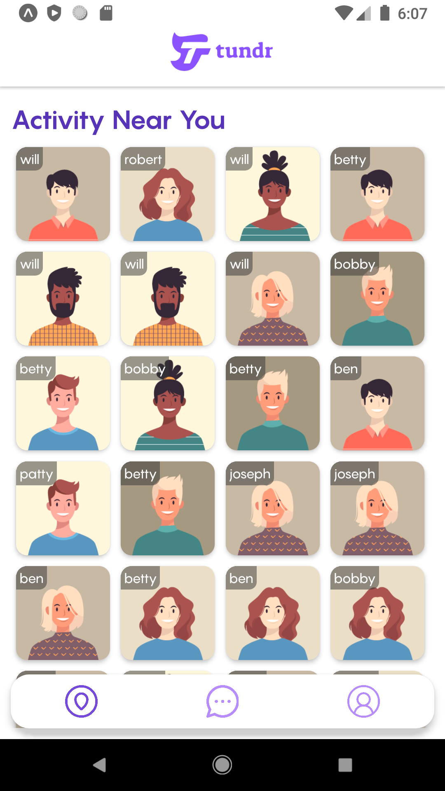
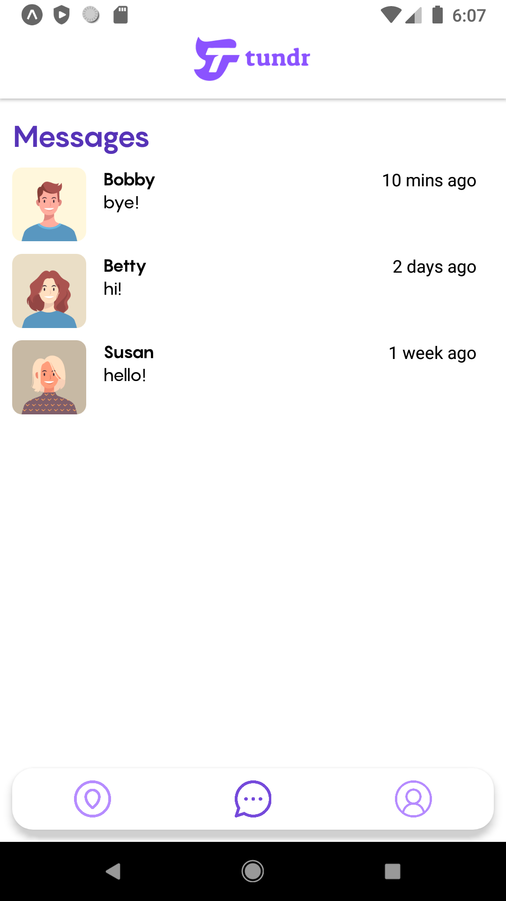
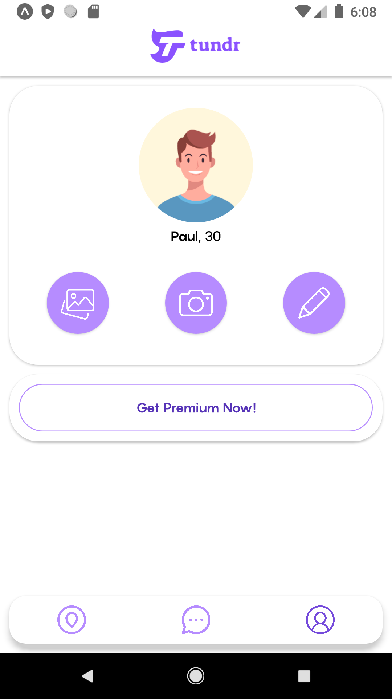
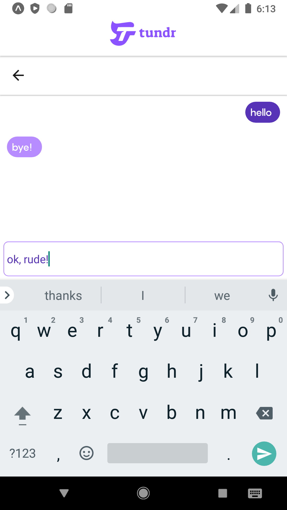
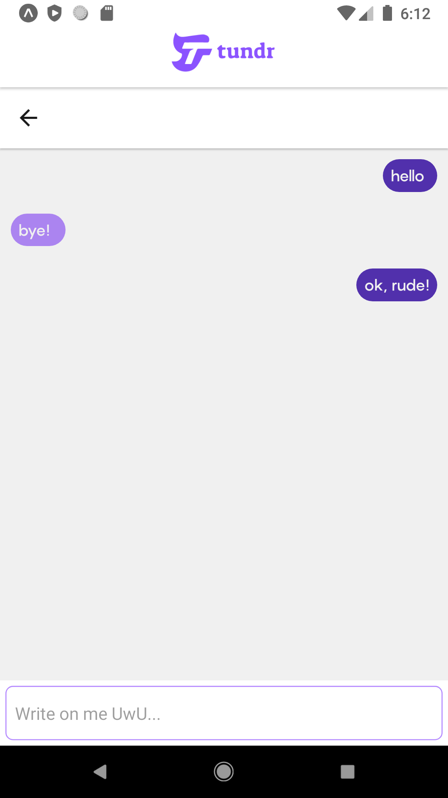

# Date App

## React-Native

### Description

Mock-up of a dating app made in React Native

It doesn't fetch external data, everything is loaded from json files

## Content

### Screens

This project contains 4 screens:

- Home
- Messages
- User Profile
- Chat

### Home Screen

### Messages Screen

### User Profile Screen

### Chat Screen

